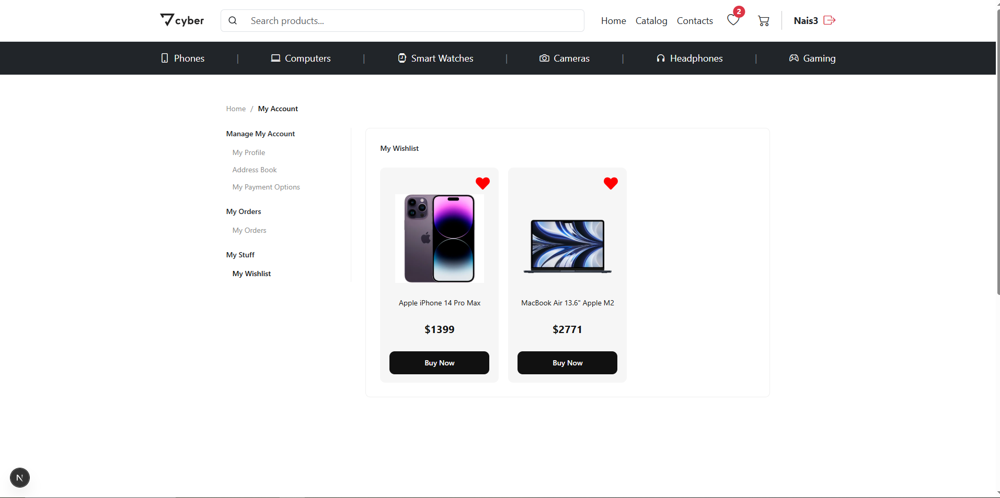
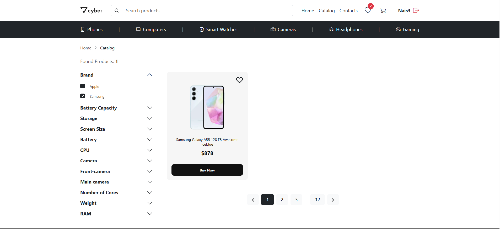

# 📱 Electronic Store Project


Повноцінний веб-застосунок для інтернет-магазину електроніки. Проєкт реалізовано з використанням класичної архітектури **Java Servlets** на бекенді та сучасного **React + TypeScript** на фронтенді.

---

## 📚 Документація (Javadoc)

Повна технічна документація backend-частини (класи, контролери, DAO) доступна тут:

👉 **[ВІДКРИТИ JAVADOC (GitHub Pages)](https://mariasshev.github.io/electronic-store/)**

---

## ✨ Основний функціонал

### 🛍 Клієнтська частина
* **Каталог товарів:** Перегляд списку з пагінацією.
* **Розумний пошук:** Пошук товарів за назвою.
* **Фільтрація:** Динамічні фільтри за категоріями, брендами та характеристиками.
* **Кошик:** Додавання/видалення товарів, зміна кількості, підрахунок суми.
* **Вішлист (Обране):** Збереження товарів на майбутнє.
* **Промокоди:** Система знижок при введенні коду (напр. `SUMMER2024`).
* **Особистий кабінет:** Історія замовлень, збережені картки, адреси доставки.

### ⚙️ Технічна частина
* **Auth:** Реєстрація та авторизація користувачів (хешування паролів через BCrypt).
* **Database:** Використання JDBC для прямої роботи з SQL (PostgreSQL/Oracle).
* **API:** RESTful API з JSON-відповідями.
* **Architecture:** MVC патерн (Controller -> Service/DAO -> Model).

---

## 📸 Скріншоти

*(Тут ви можете вставити посилання на картинки. Зробіть скріншоти сайту і покладіть їх у папку `screenshots/` у корені проєкту, або просто завантажте в issue на гітхабі і скопіюйте посилання)*

| Вішліст | Каталог |
|:---:|:---:|
|  |  |

---

## 🛠 Технологічний стек

* **Backend:** Java 17, Jakarta Servlets, JDBC, Gradle, Gson, BCrypt.
* **Frontend:** React.js, TypeScript, React Router, Axios, CSS Modules.
* **Database:** Oracle Database.
* **DevOps:** GitHub Actions (для деплою документації).

---

## 🚀 Інструкція із запуску

### 1. Налаштування Бази Даних
1. Створіть базу даних (наприклад, `elstore`).
2. Виконайте SQL-скрипт `db_init.sql` (знаходиться в корені проєкту), щоб створити таблиці.
3. Відкрийте `src/main/java/org/store/config/DBConnection.java` і вкажіть свої дані:
   ```java
   private static final String URL = "jdbc:postgresql://localhost:5432/elstore";
   private static final String USER = "postgres";
   private static final String PASSWORD = "your_password";
